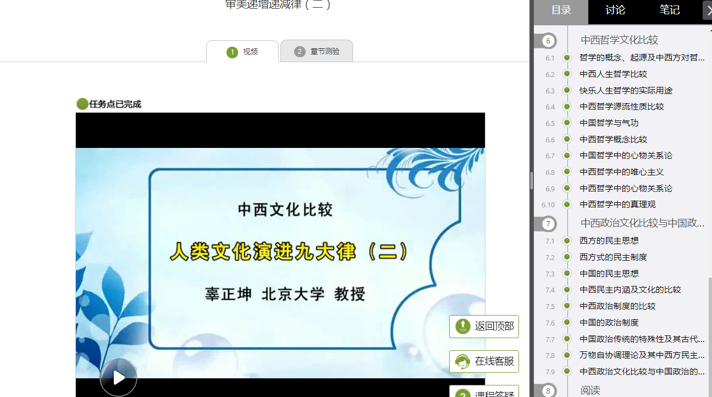

# 尔雅自动观看

- 目前已经测试过多个账号和多个课程，无不良记录现象
- 由于没有题库，通过爬虫得到答案准确率不够高(60%左右)，暂时去掉自动答题功能
- 可以自己先把题做完，自动解锁，然后自动观看(至少本人是这样做的)





##　使用方法 (环境python2)
1. 在config.json中写你的账号和密码

2. 开始运行脚步 
```
python eryaLook -s 或者 eryaLook -s
```
3. 输入提取码，请看verImg.png


## 致谢
- 请在上方Star
- 有问题提交Issue，欢迎改进并pull request。

